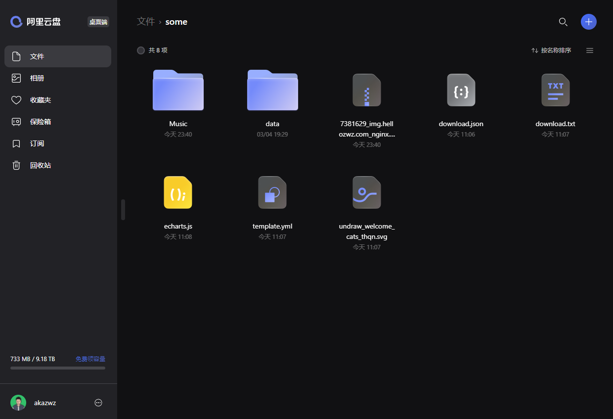
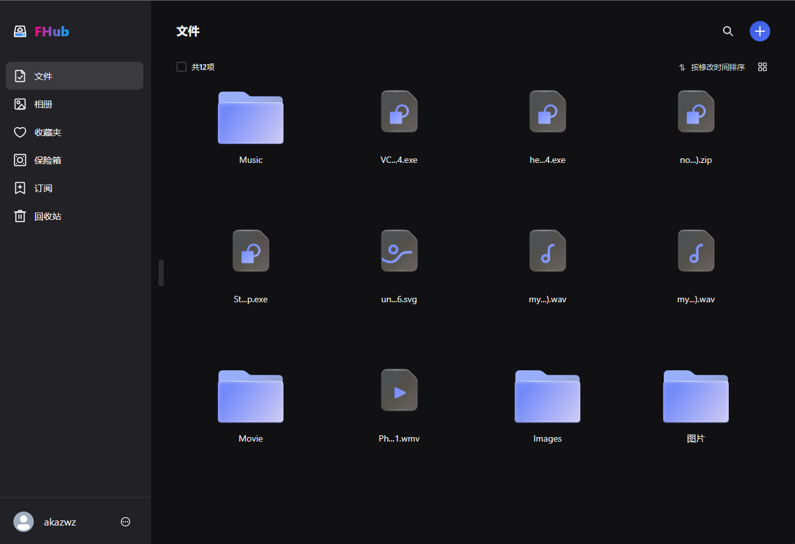

# FHub web

## 使用 Gin 和 React 构建的简单网盘，界面布局仿照阿里云盘网页端

## 截图

1. 阿里云盘：
   

2. FHub：
   

## 用到的技术和库 （Web端）

1. react (js框架)
2. typescript
3. next (react 框架)
4. recoil (全局状态管理)
5. chakra ui (ui lib)
6. crypto-js (文件hash)
7. use-hashcode (自己写的哈希计算大文件的 react hook)
8. qiniu-js (七牛对象存储和cdn)
9. react-image-lightbox (图片在线预览)
10. @icon-park/react (图标)
